# APP_INFRASTRUCTURE.md

> **Hyperliquid Autonomous Trading Firm — Application Infrastructure Reference**
> Version: 1.0.1 | Last Updated: 2026-04-07

---

## Table of Contents

1. [Overview](#overview)
2. [Infrastructure Philosophy](#infrastructure-philosophy)
3. [Top-Level Architecture](#top-level-architecture)
4. [Hyperliquid DEX Node Cluster](#hyperliquid-dex-node-cluster)
5. [Data & Storage Layer](#data--storage-layer)
6. [AI Agent Platform](#ai-agent-platform)
7. [Application Services](#application-services)
8. [Observability Stack](#observability-stack)
9. [Networking & Edge](#networking--edge)
10. [Public Cloud & External Services](#public-cloud--external-services)
11. [Public API Failover Map](#public-api-failover-map)
12. [Security & Secrets](#security--secrets)
13. [Kubernetes & Container Platform](#kubernetes--container-platform)
14. [Deployment Topology Summary](#deployment-topology-summary)

---

## Overview

This document describes the complete on-premises and hybrid infrastructure required to operate the Hyperliquid Autonomous Trading Firm at institutional scale. It covers all self-hosted services, their roles and interdependencies, the Hyperliquid DEX blockchain node cluster, AI agent runtimes, databases, observability tooling, and edge/cloud integrations.

**Design principles:**

- **Local-first data plane** — All market data, order book feeds, and trading decisions consume local node services. Public endpoints are fallback only for all non-execution paths.
- **Public endpoints for order submission only** — HyperCore trade submission always routes to `api.hyperliquid.xyz`; this cannot be replaced by local infra.
- **Defense in depth** — Every self-hosted critical service has a documented public fallback endpoint listed in the [Public API Failover Map](#public-api-failover-map).
- **Zero-trust networking** — All inter-service communication traverses Tailscale mesh; no service exposes raw ports to the public internet.
- **GitOps** — All K8s workloads are declared in `infra/k8s/` and reconciled by ArgoCD.

---

## Infrastructure Philosophy

| Path | Primary (Self-Hosted) | Fallback (Public / Managed) | Notes |
|---|---|---|---|
| L1 block data | `hl-node` (local) | `api.hyperliquid.xyz` gossip peers | Local preferred; ~100 GB/day log output |
| Order book feed | `order-book-server` (local WS) | `wss://api.hyperliquid.xyz/ws` | Local has L4 full-depth; public is L2 only |
| Info API (margin, positions) | `--serve-info` on `hl-node:3001` | `https://api.hyperliquid.xyz/info` | Local subset only; historical not supported |
| EVM RPC | `hl-node --serve-eth-rpc :3001/evm` | Chainstack / Dwellir managed RPC | Local first; managed RPC as hot standby |
| Historical EVM | `hyper-evm-sync` archive | AWS S3 `hl-mainnet-evm-blocks` | S3 is the upstream source regardless |
| Trade submission | `api.hyperliquid.xyz/exchange` | *(same — cannot be self-hosted)* | Always public; minimize latency via Tokyo co-location |
| LLM inference | Ollama (on-prem GPU) | Anthropic / OpenAI APIs | On-prem for FinBERT/small models; cloud for opus/o3 |
| Analytics dashboard | `hyperliquid-stats` (self-hosted) | Hyperliquid public stats site | Self-hosted for operator-private data |

---

## Top-Level Architecture

```mermaid
graph TB
    subgraph INTERNET["☁️ Public Internet / External Services"]
        HL_API["api.hyperliquid.xyz\n(Trade Submission / Info Fallback)"]
        CF["Cloudflare\n(DNS · WAF · Tunnel)"]
        TG["Tailscale\n(WireGuard Mesh VPN)"]
        AWS["AWS S3\n(hl-mainnet-evm-blocks)"]
        AKASH["Akash Network\n(Overflow Compute)"]
        FLY["Fly.io\n(Geo-Edge Agents)"]
        ANTHRO["Anthropic API\n(Claude Opus/Sonnet)"]
        OPENAI["OpenAI API\n(GPT-4o / o3)"]
        PERP["Perplexity API"]
        VENICE["Venice.ai API"]
        KIMI["Kimi Moonshot API"]
        AGENTMAIL["agentmail.to\n(Alerts / Reports)"]
        SMEM["supermemory.ai\n(Shared Agent Memory)"]
        CHAINSTACK["Chainstack\n(Managed HL RPC Fallback)"]
    end

    subgraph EDGE["🌐 Edge / CDN Layer"]
        CF_TUNNEL["Cloudflare Tunnel\n(Zero-Trust Ingress)"]
        NGINX["nginx / Traefik\n(Reverse Proxy · TLS · Rate Limit)"]
    end

    subgraph K8S["⚙️ On-Prem Kubernetes Cluster (Primary DC — Tokyo-Adjacent)"]
        subgraph HL_NODE_CLUSTER["Hyperliquid DEX Node Cluster"]
            HL_NODE_1["hl-node-1\nnon-validator\n--write-fills\n--write-order-statuses\n--write-raw-book-diffs\n--batch-by-block\n--serve-info\n--serve-eth-rpc"]
            HL_NODE_2["hl-node-2\nnon-validator\n(HA replica)"]
            OBS["order-book-server\n:8000 WebSocket\nL2 · L4 Book"]
            PRUNER["node-pruner\n(log rotation cron)"]
            MEMPOOL["mempool-stream\n(split_client_blocks)"]
            EVM_SYNC["hyper-evm-sync\n(archive node)"]
            BLOCK_IMP["block-importer\n(bootstrap batch job)"]
        end

        subgraph DATA_LAYER["Data & Storage Layer"]
            KAFKA["Apache Kafka\n(Event Bus)"]
            TIMESCALE["TimescaleDB\n(Tick · Funding · OI)"]
            POSTGRES["PostgreSQL\n(DecisionTrace · Audit · Prompt Policies)"]
            REDIS["Redis\n(24h State Cache · Rate Control)"]
            MILVUS["Milvus\n(Vector Store · RAG)"]
            DELTA["MinIO / Delta Lake\n(Columnar History · RL Training)"]
            STATS_DB["PostgreSQL\n(hyperliquid-stats)"]
        end

        subgraph AGENT_PLATFORM["AI Agent Platform"]
            ORCH["orchestrator-api\n(Node/TS — Cycle Coordinator)"]
            AGENTS["agents-svc\n(Python — TradingAgents)"]
            SAE["sae-engine\n(Node/TS — Hard Safety Gates)"]
            EXECUTORS["executors-svc\n(Python — HL Paper/Live)"]
            TREASURY["treasury-svc\n(Python — BTC→Stable)"]
            OPTIMIZER["optimizer-agent\n(Python — Off-path RL/OPRO)"]
            JOBS["jobs-svc\n(Python — Backtest · Ablation · Prompt Scoring)"]
            ELIZA["ElizaOS\n(Web3 Agent Runtime)"]
            INTELLICLAW["IntelliClaw\n(Market Intel Engine)"]
            OPENCLAW["OpenClaw / MultiClawCore\n(Control Plane · HITL)"]
        end

        subgraph OBS_STACK["Observability Stack"]
            PROM["Prometheus\n(Metrics Scrape)"]
            GRAFANA["Grafana\n(Dashboards)"]
            LOKI["Loki\n(Log Aggregation)"]
            TEMPO["Tempo\n(Distributed Traces)"]
            ALERT["Alertmanager\n(PagerDuty · Slack · agentmail)"]
            MLFLOW["MLflow\n(Experiment Tracking)"]
        end

        subgraph APP_SERVICES["Application Services"]
            DASHBOARD["dashboard\n(Next.js — Decisions · Governance · PnL)"]
            OPENWEBUI["Open WebUI\n(LLM Management UI)"]
            HL_STATS["hyperliquid-stats\n(FastAPI + PostgreSQL)"]
            HL_STATS_WEB["hyperliquid-stats-web\n(React Frontend)"]
            OLLAMA["Ollama\n(Local LLM Inference · FinBERT · Nomic-Embed)"]
            REGISTRY["Harbor / GHCR\n(Container Registry)"]
            ARGOCD["ArgoCD\n(GitOps Controller)"]
            RANCHER["Rancher / Lens\n(K8s Management Plane)"]
        end
    end

    subgraph BACKUP_DC["🔁 Secondary DC / Edge Node (Tailscale-Connected)"]
        HL_NODE_3["hl-node-3\nnon-validator\n(disaster recovery)"]
        PG_REPLICA["PostgreSQL Replica"]
        KAFKA_MIRROR["Kafka MirrorMaker"]
    end

    CF --> CF_TUNNEL --> NGINX
    NGINX --> DASHBOARD
    NGINX --> OPENWEBUI
    NGINX --> HL_STATS_WEB
    NGINX --> ARGOCD
    NGINX --> GRAFANA

    HL_NODE_1 --> OBS
    HL_NODE_1 --> KAFKA
    HL_NODE_2 --> KAFKA
    OBS --> KAFKA

    KAFKA --> AGENTS
    KAFKA --> TIMESCALE
    KAFKA --> REDIS

    AGENTS --> SAE
    SAE --> EXECUTORS
    EXECUTORS --> HL_API

    ORCH --> AGENTS
    ORCH --> SAE
    ORCH --> TREASURY
    ORCH --> OPENCLAW

    OPENCLAW --> ORCH

    INTELLICLAW --> AGENTS
    ELIZA --> ORCH

    AGENTS --> POSTGRES
    AGENTS --> MILVUS
    TREASURY --> POSTGRES
    OPTIMIZER --> POSTGRES
    OPTIMIZER --> DELTA

    PROM --> GRAFANA
    LOKI --> GRAFANA
    TEMPO --> GRAFANA
    ALERT --> AGENTMAIL

    EVM_SYNC --> AWS
    BLOCK_IMP --> HL_NODE_1

    TG --> K8S
    TG --> BACKUP_DC

    HL_NODE_1 -. "failover" .-> HL_API
    OBS -. "failover" .-> HL_API
    EXECUTORS --> HL_API

    AGENTS --> ANTHRO
    AGENTS --> OPENAI
    AGENTS --> PERP
    AGENTS --> VENICE
    AGENTS --> KIMI
    AGENTS --> SMEM

    JOBS --> MLFLOW
    JOBS --> DELTA

    ARGOCD --> K8S
    REGISTRY --> K8S
```

---

## Hyperliquid DEX Node Cluster

This cluster is the core data plane for all market data. All agent services consume from here rather than public endpoints.

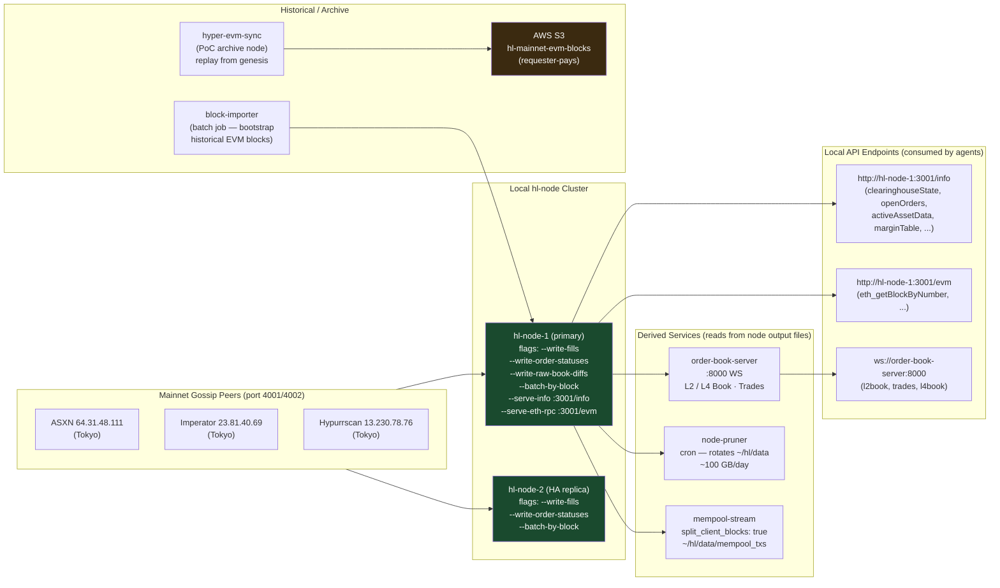

### Node Hardware Requirements

| Role | vCPUs | RAM | Storage | Network |
|---|---|---|---|---|
| `hl-node` non-validator | 16 | 64 GB | 500 GB NVMe SSD | Ports 4001/4002 open, low-latency to Tokyo |
| `order-book-server` | 4 | 16 GB | 50 GB | Same host or same rack as `hl-node` |
| `hyper-evm-sync` | 8 | 32 GB | 2 TB NVMe SSD | High throughput (S3 sync) |

> ⚠️ **Caveat:** `order-book-server` is a community-contributed repo, not written by Hyperliquid Labs. It auto-exits on state desync; configure a K8s liveness probe or systemd `Restart=on-failure` for HA. It does not support spot order books or untriggered trigger orders.

---

## Data & Storage Layer

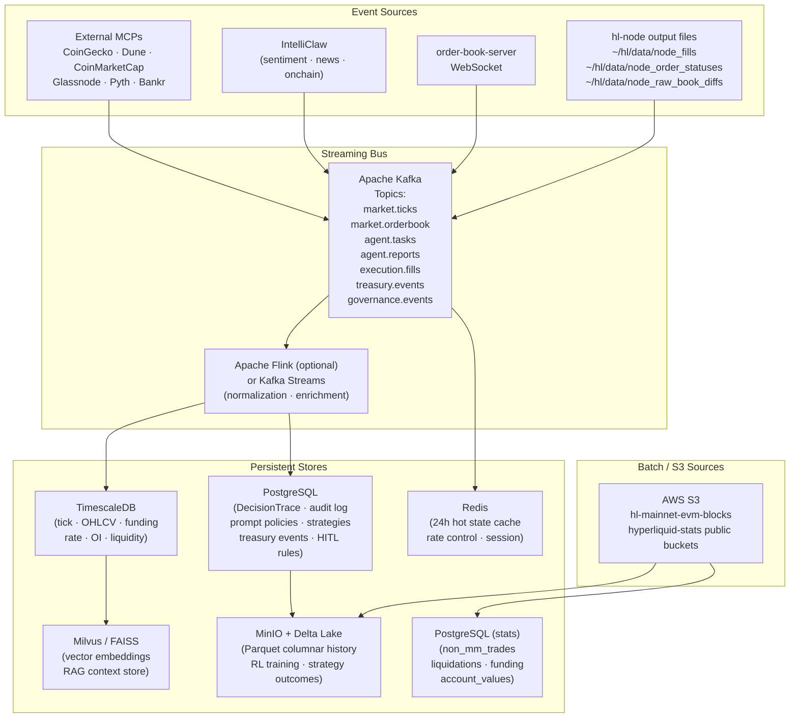

---

## AI Agent Platform

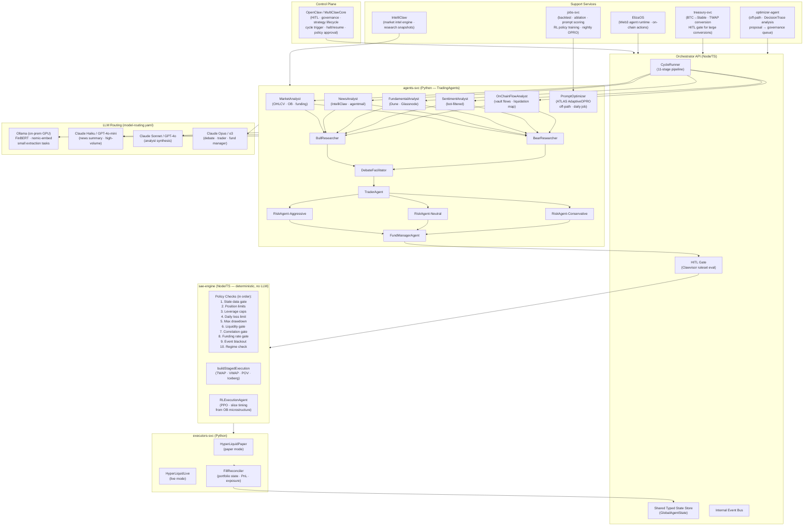

---

## Application Services

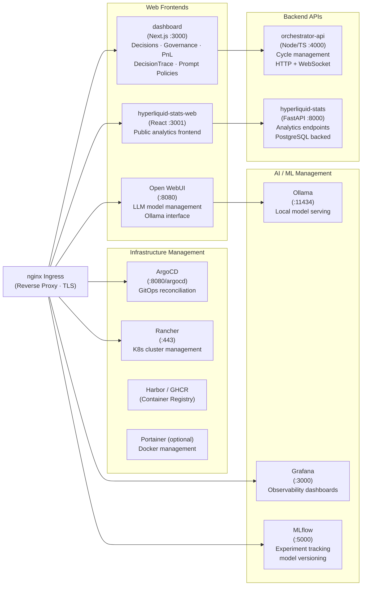

---

## Observability Stack

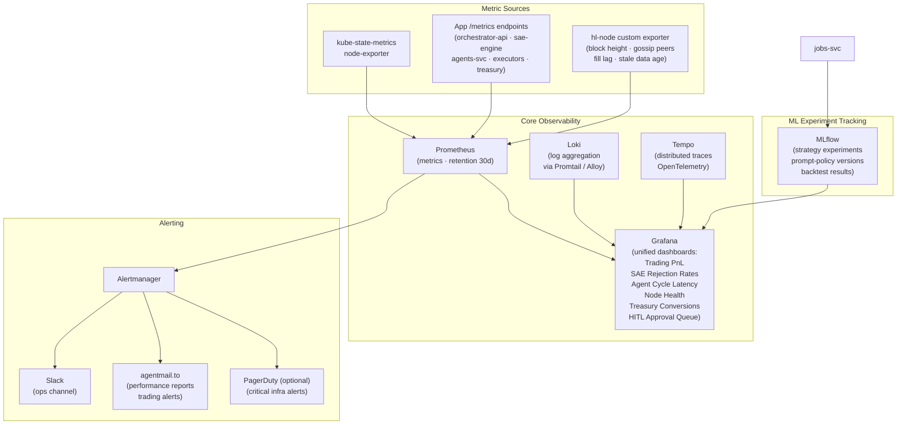

### Key Alert Thresholds

| Alert | Condition | Severity |
|---|---|---|
| `trading.drawdown.critical` | Portfolio drawdown > 6% | Critical |
| `safety.staledata` | Market snapshot age > 90s in live mode | Critical |
| `safety.saerejectionspike` | SAE rejection rate > 30% over 10 cycles | High |
| `process.cyclelatency` | Cycle P95 latency > 8s | High |
| `infra.agentservicedown` | Agent service health check fails 30s | Critical |
| `treasury.conversionfailed` | Treasury conversion not filled within 30 min | High |
| `node.gossiplag` | `hl-node` block height > 100 behind peers | Critical |
| `node.diskpressure` | `~/hl/data` partition > 80% full | High |

---

## Networking & Edge

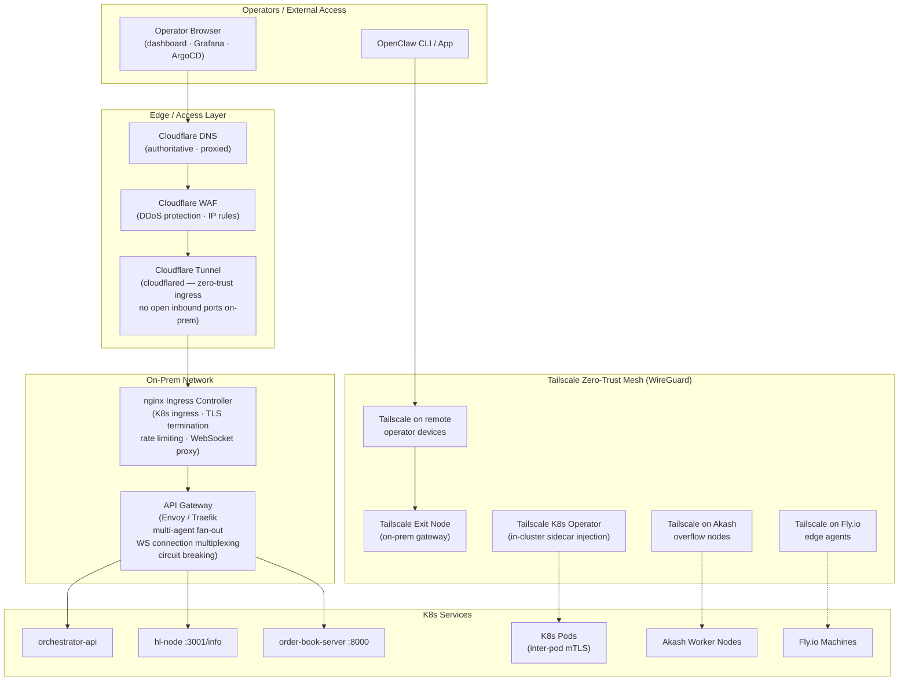

---

## Public Cloud & External Services

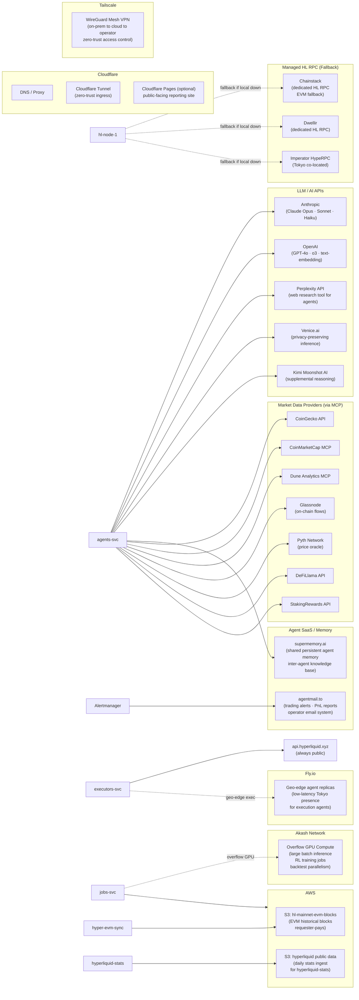

---

## Public API Failover Map

> All services should implement retry logic with exponential backoff before switching to fallback. Circuit breaker pattern required at the API gateway layer.

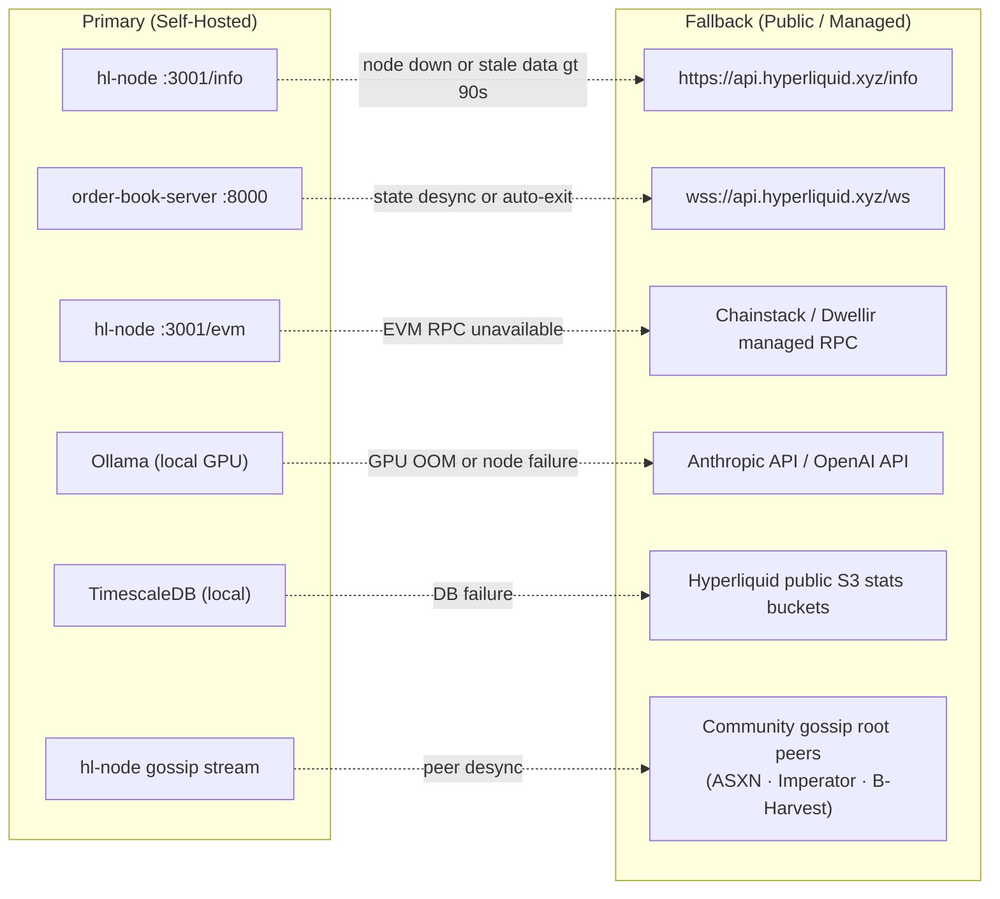

| Service | Primary | Fallback | Trigger Condition | Notes |
|---|---|---|---|---|
| Info API | `hl-node:3001/info` | `api.hyperliquid.xyz/info` | Snapshot age > 90s or node crash | Subset of requests only on local |
| L2/L4 Order Book | `order-book-server:8000` | `wss://api.hyperliquid.xyz/ws` | Auto-exit / desync | Public is L2 only; L4 not available |
| EVM JSON-RPC | `hl-node:3001/evm` | Chainstack / Dwellir | RPC error / timeout | Managed RPC has broader method support |
| Block data stream | Local gossip | Community root peers | Peer count < 2 | See gossip peer list in node README |
| LLM inference | Ollama on-prem | Anthropic / OpenAI | OOM / node failure | On-prem for FinBERT; cloud for opus/o3 |
| Trade submission | `api.hyperliquid.xyz/exchange` | *(no alternative)* | N/A | Always public; cannot be self-hosted |
| Historical stats | `hyperliquid-stats` (local) | Public HL stats site | DB failure | Stats serve lagged data only (daily cron) |

---

## Security & Secrets

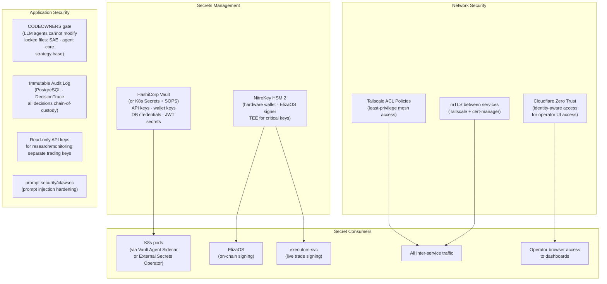

---

## Kubernetes & Container Platform

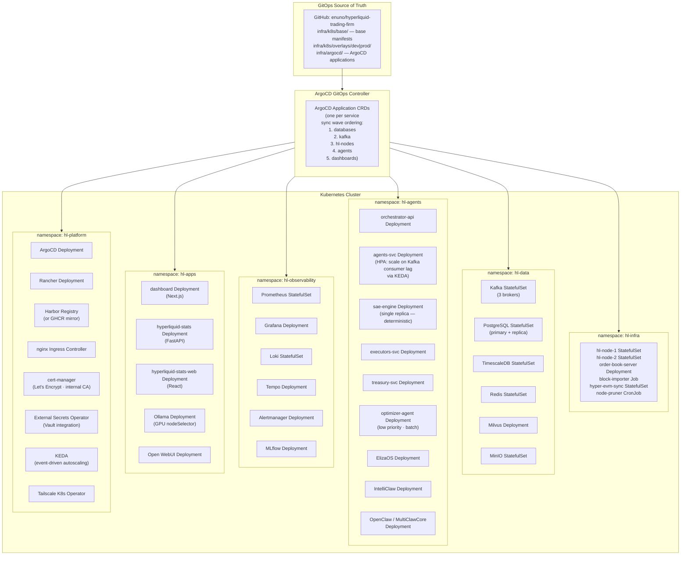

---

## Deployment Topology Summary

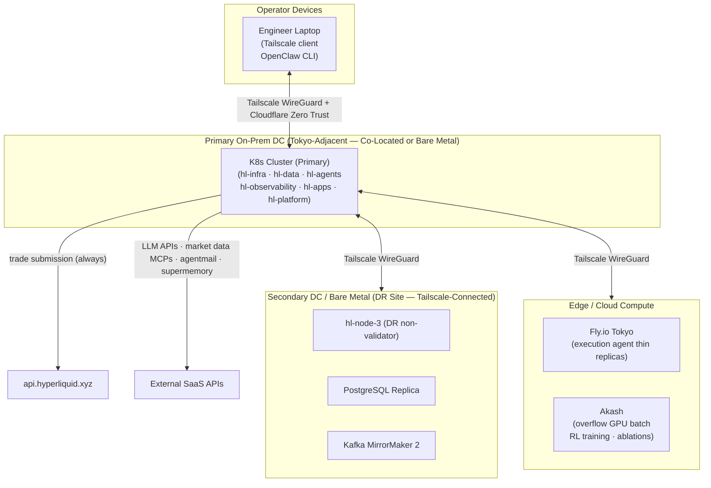

---

## Component Inventory Quick Reference

| Component | Repo / Source | Namespace | Role | HA |
|---|---|---|---|---|
| `hl-node` | `hyperliquid-dex/node` | `hl-infra` | L1 data source, info API, EVM RPC | 2 replicas |
| `order-book-server` | `hyperliquid-dex/order_book_server` | `hl-infra` | Local L2/L4 WS feed | Restart policy |
| `hyper-evm-sync` | `hyperliquid-dex/hyper-evm-sync` | `hl-infra` | EVM archive node | Single |
| `block-importer` | `hyperliquid-dex/block-importer` | `hl-infra` | Bootstrap batch job | Job |
| `hyperliquid-stats` | `hyperliquid-dex/hyperliquid-stats` | `hl-apps` | Analytics API | Single |
| `hyperliquid-stats-web` | `hyperliquid-dex/hyperliquid-stats-web` | `hl-apps` | Analytics frontend | 2 replicas |
| `orchestrator-api` | `enuno/hyperliquid-trading-firm` | `hl-agents` | Cycle coordinator | 2 replicas |
| `agents-svc` | `enuno/hyperliquid-trading-firm` | `hl-agents` | TradingAgents pipeline | KEDA HPA |
| `sae-engine` | `enuno/hyperliquid-trading-firm` | `hl-agents` | Hard safety gates | Single |
| `executors-svc` | `enuno/hyperliquid-trading-firm` | `hl-agents` | HL paper/live execution | 2 replicas |
| `treasury-svc` | `enuno/hyperliquid-trading-firm` | `hl-agents` | BTC to stable conversion | Single |
| `optimizer-agent` | `enuno/hyperliquid-trading-firm` | `hl-agents` | Off-path RL/OPRO | Single |
| `intelliclaw` | internal | `hl-agents` | Market intel engine | 2 replicas |
| `eliza-os` | `elizaOS/eliza` | `hl-agents` | Web3 agent runtime | 2 replicas |
| `openclaw` | internal | `hl-agents` | HITL + governance control plane | Single |
| `kafka` | Apache Kafka | `hl-data` | Event bus | 3 brokers |
| `timescaledb` | TimescaleDB | `hl-data` | Tick/funding time-series | Primary + replica |
| `postgresql` | PostgreSQL | `hl-data` | DecisionTrace/audit/policies | Primary + replica |
| `redis` | Redis | `hl-data` | Hot state cache | Sentinel |
| `milvus` | Milvus | `hl-data` | Vector store / RAG | Single |
| `minio` | MinIO | `hl-data` | Delta Lake / RL training data | 4-node erasure |
| `prometheus` | Prometheus | `hl-observability` | Metrics | Single |
| `grafana` | Grafana | `hl-observability` | Dashboards | 2 replicas |
| `loki` | Grafana Loki | `hl-observability` | Log aggregation | Single |
| `tempo` | Grafana Tempo | `hl-observability` | Distributed tracing | Single |
| `alertmanager` | Alertmanager | `hl-observability` | Alert routing | 2 replicas |
| `mlflow` | MLflow | `hl-observability` | Experiment tracking | Single |
| `dashboard` | `enuno/hyperliquid-trading-firm` | `hl-apps` | Trading firm UI | 2 replicas |
| `ollama` | Ollama | `hl-apps` | Local LLM inference | GPU-pinned |
| `open-webui` | Open WebUI | `hl-apps` | LLM management UI | Single |
| `argocd` | ArgoCD | `hl-platform` | GitOps controller | HA mode |
| `rancher` | Rancher | `hl-platform` | K8s management plane | Single |
| `harbor` | Harbor | `hl-platform` | Container registry | 2 replicas |
| `nginx-ingress` | nginx | `hl-platform` | Reverse proxy / TLS | 2 replicas |
| `cert-manager` | cert-manager | `hl-platform` | TLS certificates | Single |
| `keda` | KEDA | `hl-platform` | Event-driven autoscaling | Single |
| `tailscale-operator` | Tailscale | `hl-platform` | Zero-trust mesh | Single |

---

*For system safety architecture, SAE policy invariants, HITL ruleset definitions, and treasury configuration, see [SPEC.md](../SPEC.md). For development phases and exit gates, see [DEVELOPMENTPLAN.md](../DEVELOPMENTPLAN.md).*
