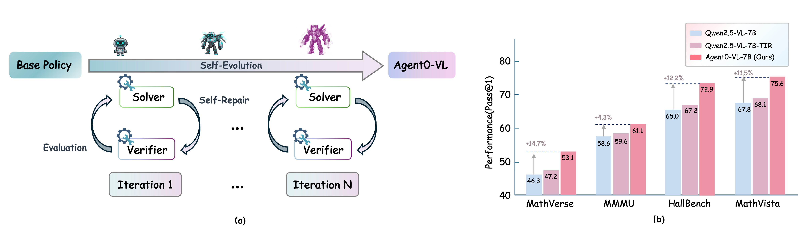

# Agent0-VL: Exploring Self-Evolving Agent for Tool-Integrated Vision-Language Reasoning

<div align="center">

[](https://arxiv.org/abs/2511.19900)
[](../LICENSE)


*A Self-Evolving Vision-Language Agent with Tool-Integrated Reasoning, Evaluation, and Self-Repair*

[Jiaqi Liu](https://jqliu.com)<sup>1</sup>, [Kaiwen Xiong](https://kwxiong.com)<sup>1</sup>, [Peng Xia](https://pengxia.com)<sup>1</sup>, [Yiyang Zhou](https://yiyzhou.com)<sup>1</sup>,<br>
[Haonian Ji](https://hji.com)<sup>1</sup>, [Lu Feng](https://lfeng.com)<sup>1</sup>, [Siwei Han](https://shan.com)<sup>1</sup>, [Mingyu Ding](https://mding.com)<sup>1</sup>, [Huaxiu Yao](https://huaxiuyao.mystrikingly.com)<sup>1</sup>

<sup>1</sup>UNC-Chapel Hill

</div>

---

## 📖 Overview

<p align="center">
  
</p>

**Agent0-VL** is a self-evolving vision-language agent that achieves continual improvement through tool-integrated reasoning, evaluation, and self-repair. Unlike traditional vision-language models that rely on external supervision, Agent0-VL autonomously refines its reasoning capabilities by unifying reasoning, verification, and correction within a single model.

### 🎯 Core Innovation

Agent0-VL introduces a **Self-Evolving Reasoning Cycle (SERC)** that enables the model to:
- **Reason**: Perform multi-turn tool-integrated visual reasoning
- **Verify**: Self-evaluate reasoning steps using tool-grounded evidence
- **Repair**: Selectively correct errors based on verification feedback
- **Evolve**: Continuously improve through reinforcement learning

This closed-loop system allows Agent0-VL to achieve **zero external reward** self-improvement, eliminating the need for human annotations or external reward models.

---

## 🔥 Key Features

### Dual-Role Architecture
Agent0-VL operates through two synergistic roles within a single LVLM:

- **🧠 Solver**: Performs multi-turn reasoning and dynamically invokes external tools (code interpreter, vision APIs) for grounded computation and visual perception.

- **✅ Verifier**: Validates intermediate reasoning steps through generative critique and tool-based feedback, generating fine-grained reward signals and repair instructions.

### Technical Highlights
- ✨ **Zero External Reward**: No human annotation or external reward models required
- 🔧 **Tool-Integrated Evaluation**: Uses external tools not only for reasoning but also for self-evaluation
- 🔄 **Selective Self-Repair**: Confidence-gated mechanism for efficient error correction
- 📈 **Iterative Evolution**: Monotonic performance improvement across training iterations
- 🎯 **Dual Functionality**: Serves as both a reasoning agent and a process reward model

---

## 📊 Performance Highlights

### Main Results on Visual Reasoning Benchmarks

Agent0-VL achieves state-of-the-art performance among open-source vision-language models:

| Model | MathVerse | MathVision | MathVista | WeMath | HallBench | ChartQA | MMMU | **Avg.** |
|-------|-----------|------------|-----------|---------|-----------|---------|------|----------|
| **Closed-Source Models** | | | | | | | | |
| GPT-4o | 50.8 | 30.4 | 63.8 | 68.8 | 55.0 | 85.7 | 69.1 | 60.5 |
| OpenAI-o1 | 57.0 | 60.3 | 73.9 | - | - | 83.1 | 77.6 | - |
| Claude-3.7-Sonnet | 52.0 | 41.3 | 66.8 | 72.6 | 55.4 | 56.5 | 75.0 | 59.9 |
| **Open-Source General MLLMs** | | | | | | | | |
| InternVL-2.5-8B | 39.5 | 19.7 | 64.4 | 53.5 | 61.7 | 79.1 | 62.7 | 54.4 |
| InternVL-3-8B | 39.8 | 29.3 | 71.6 | 58.1 | 64.3 | 85.9 | 60.7 | 58.5 |
| Qwen2.5-VL-7B | 46.3 | 25.1 | 67.8 | 62.1 | 65.0 | 83.5 | 58.6 | 58.3 |
| Qwen3-VL-8B | 62.1 | 53.9 | 77.2 | 72.5 | 72.1 | 84.6 | 69.6 | 70.3 |
| **Open-Source Reasoning MLLMs** | | | | | | | | |
| Vision-R1-7B | 51.9 | 30.7 | 73.5 | 73.9 | 68.8 | 79.8 | 50.5 | 61.3 |
| OpenVLThinker-7B | 45.7 | 26.3 | 71.2 | 66.7 | 70.2 | 78.4 | - | - |
| MM-Eureka-7B | 50.5 | 27.9 | 73.6 | 67.4 | 66.9 | 82.1 | 52.7 | 60.2 |
| ThinkLite-VL-7B | 52.1 | 32.9 | 75.1 | 69.3 | 70.9 | 84.8 | 55.5 | 62.9 |
| **Agent0-VL-7B (Ours)** | **53.1** | **37.3** | **75.6** | **71.7** | **72.9** | **87.3** | **61.1** | **65.6** |
| **Agent0-VL-8B (Ours)** | **65.5** | **56.2** | **83.7** | **79.6** | **74.3** | **89.7** | **73.4** | **74.6** |

**Key Takeaways:**
- 🏆 **Agent0-VL-8B** achieves the best overall performance among all open-source models
- 📈 **+12.5%** average improvement over Qwen2.5-VL-7B base model
- 🎯 **+6.1%** improvement over stronger Qwen3-VL-8B base model
- 🔥 Outperforms GPT-4o on MathVista, HallBench, and ChartQA

---

## 🔬 In-Depth Analysis

### Iterative Self-Evolution Performance

Agent0-VL demonstrates **monotonic improvement** across training iterations:

| Model Stage | MathVerse | MathVision | MathVista | WeMath | HallBench | ChartQA | MME-Real | MMMU | **Avg.** |
|-------------|-----------|------------|-----------|---------|-----------|---------|----------|------|----------|
| Base Model (Qwen2.5-VL-7B) | 46.3 | 25.1 | 67.8 | 62.1 | 65.0 | 83.5 | 58.3 | 50.6 | 57.3 |
| **Iteration 1** | 48.4 | 29.6 | 69.2 | 66.8 | 67.9 | 84.7 | 63.9 | 53.7 | 60.5 |
| **Iteration 2** | 51.1 | 35.3 | 72.8 | 70.1 | 70.3 | 86.1 | 64.7 | 58.3 | 63.6 |
| **Iteration 3** | 53.1 | 37.3 | 75.6 | 71.7 | 72.9 | 87.3 | 65.3 | 61.1 | 65.5 |
| **Cumulative Gain** | +6.8 | +12.2 | +7.8 | +9.6 | +7.9 | +3.8 | +7.0 | +10.5 | **+8.2** |

**Observations:**
- ✅ Consistent improvement across all benchmarks
- 📊 **Iteration 1**: +5.2% improvement
- 📊 **Iteration 2**: +4.0% additional gain
- 📊 **Iteration 3**: +2.8% further improvement
- 🎯 Validates the effectiveness of self-evolving framework

### Performance as a Process Reward Model

Agent0-VL can be used independently as a **Process Reward Model (PRM)** to enhance other vision-language models through Best-of-N sampling:

| Base Model | Without PRM | **+ Agent0-VL PRM** | Improvement |
|------------|-------------|---------------------|-------------|
| Qwen2.5-VL-3B | 50.0 | **53.6** | **+3.6** |
| Qwen2.5-VL-7B | 58.3 | **62.8** | **+4.5** |
| InternVL-2.5-8B | 53.0 | **57.2** | **+4.2** |
| InternVL-3-8B | 58.2 | **61.8** | **+3.6** |
| Qwen2.5-VL-32B | 64.4 | **69.1** | **+4.7** |
| **Average** | - | - | **+7.3%** |

**Key Insights:**
- 🔍 Generalizes across different model architectures and scales
- 📈 Provides structured, tool-grounded feedback
- 🎯 Improves test-time scaling performance significantly
- 💡 Demonstrates standalone utility beyond self-evolution


### Domain-Specific Performance

Agent0-VL excels across different task domains:

**Mathematical Reasoning** (MathVista, WeMath, MathVerse, MathVision):
- 🧮 **7B Model**: +18.1% over base model
- 🧮 **8B Model**: +7.4% over base model
- 🎯 Tool-grounded execution crucial for symbolic reasoning

**Visual Perception** (HallusionBench, ChartQA):
- 👁️ **Hallucination Reduction**: +12.2% on HallusionBench
- 📊 **Chart Understanding**: +3.1% on ChartQA
- ✅ Verifier's factual grounding reduces visual hallucinations


**Code release coming soon!**

---


## 📚 Citation

If you find Agent0-VL helpful for your research, please cite our paper:

```bibtex
@article{liu2025agent0vl,
  title={Agent0-VL: Exploring Self-Evolving Agent for Tool-Integrated Vision-Language Reasoning},
  author={Liu, Jiaqi and Xiong, Kaiwen and Xia, Peng and Zhou, Yiyang and Ji, Haonian and Feng, Lu and Han, Siwei and Ding, Mingyu and Yao, Huaxiu},
  journal={arXiv preprint arXiv:2511.19900},
  year={2025}
}
```

---
